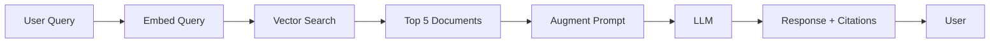

# RAG Strategy Template

**Team Name:** [Your Team Name]  
**Project:** [Your Project Name]  
**Date:** [Date]

---

## 1. Do We Need RAG?

**Decision:** ☐ YES, we're using RAG  |  ☐ NO, we're not using RAG

**Reasoning:**

[Explain why you are or aren't using RAG. If NO, explain your alternative approach for accessing knowledge/data.]

**Examples:**
- ✅ YES: "We need to search through 50 company policy PDFs to answer employee questions"
- ✅ YES: "Our app answers questions about 10,000 product descriptions in our database"
- ✅ NO: "We're calling real-time APIs for stock prices - no stored documents to search"
- ✅ NO: "Our app generates creative content - doesn't need to retrieve existing knowledge"

---

## 2. Knowledge Sources

If using RAG, what data will your AI search through?

### Primary Knowledge Sources

**Source 1: [Name]**
- **Type:** PDF documents / Database / Web pages / Other: _______
- **Location:** [Where the data lives: file path, database name, API endpoint]
- **Quantity:** [How much: number of files, records, pages]
- **Update Frequency:** [How often this data changes: daily, weekly, never]
- **Content Description:** [What's in this source]

**Example:**
```
Source 1: Company Policy Documents
- Type: PDF documents
- Location: /data/policies/ 
- Quantity: 50 files, approximately 500 pages total
- Update Frequency: Quarterly (4x per year)
- Content: HR policies, safety procedures, benefits information, remote work guidelines
```

**Source 2: [Name]**
- **Type:** 
- **Location:** 
- **Quantity:** 
- **Update Frequency:** 
- **Content Description:** 

**Source 3: [Name]** (if applicable)
- **Type:** 
- **Location:** 
- **Quantity:** 
- **Update Frequency:** 
- **Content Description:** 

---

## 3. RAG Architecture Choice

Select ONE architecture:

### ☐ Option A: Traditional RAG (Most Common)
```
User Query → Embed Query → Vector Search → Top K Documents → 
Inject into Prompt → LLM → Response with Citations
```

**When to use:**
- You have documents (PDFs, markdown files, web pages)
- Content doesn't change extremely frequently
- Need to cite sources in responses

**Our reasoning for choosing this:**
[If selected, explain why this fits your project]

---

### ☐ Option B: Database RAG
```
User Query → SQL/NoSQL Query → Retrieve Records → Format Data → 
Inject into Prompt → LLM → Response
```

**When to use:**
- Data is already in structured database tables
- Data changes frequently (real-time or near real-time)
- Querying structured data fields

**Our reasoning for choosing this:**
[If selected, explain why this fits your project]

---

### ☐ Option C: Hybrid RAG
```
User Query → [Vector Search + Database Query] → Combine Results → 
Rerank → Inject into Prompt → LLM → Response
```

**When to use:**
- Mix of documents AND structured database data
- Need both historical context (docs) and current data (DB)
- Complex queries requiring multiple data sources

**Our reasoning for choosing this:**
[If selected, explain why this fits your project]

---

### ☐ Option D: No RAG (Function Calling Only)
```
User Query → AI Decides → Call External API → Get Data → 
AI Synthesizes → Response
```

**When to use:**
- All data comes from external APIs (not stored by you)
- Real-time data from third-party services
- No document corpus to search

**Our reasoning for choosing this:**
[If selected, explain why this fits your project]

---

## 4. Technical Implementation

**Only fill this out if you selected Options A, B, or C above**

### Embedding Model
- **Model Name:** [e.g., text-embedding-3-small, text-embedding-3-large]
- **Dimensions:** [e.g., 1536, 3072]
- **Cost:** [e.g., $0.02 per 1M tokens]
- **Why we chose this:** [Brief reasoning]

**Recommendations:**
- `text-embedding-3-small` (1536 dim, $0.02/1M tokens) - Good balance for most projects
- `text-embedding-3-large` (3072 dim, $0.13/1M tokens) - Higher quality, more expensive

### Vector Database
- **Service/Tool:** [e.g., Pinecone, Chroma, FAISS, pgvector]
- **Plan/Tier:** [e.g., Pinecone Serverless (free tier), Chroma local, pgvector extension]
- **Index Name:** [e.g., project-knowledge-base]
- **Similarity Metric:** [e.g., Cosine similarity, Euclidean distance]
- **Why we chose this:** [Brief reasoning]

**Recommendations:**
- **Pinecone Serverless** - Managed, scales automatically, $0 for low usage
- **Chroma** - Free, local development, easy to set up
- **pgvector** - If you're already using PostgreSQL

### Chunking Strategy
- **Method:** [e.g., Fixed size, Recursive text splitter, Semantic chunking]
- **Chunk Size:** [e.g., 1000 tokens, 500 characters]
- **Overlap:** [e.g., 200 tokens, 100 characters]
- **Why we chose this:** [Brief reasoning]

**Recommendations:**
- **RecursiveCharacterTextSplitter** with 1000 token chunks, 200 token overlap
- Preserves context across chunks
- Works well for most document types

### Retrieval Parameters
- **Top K (number of documents to retrieve):** [e.g., 3, 5, 10]
- **Similarity Threshold:** [e.g., 0.7, 0.75]
- **Reranking:** [Yes/No] - [If yes, what method?]
- **Maximum Context Length:** [e.g., 4000 tokens total]

**Recommendations:**
- Top K: 5 documents (balance between context and noise)
- Similarity threshold: 0.7 (filter out irrelevant results)
- Reranking: Optional for MVP, improves quality

---

## 5. Citation Strategy

How will users see where information came from?

### Citation Format

**Example Response with Citations:**
```
According to the Employee Handbook, remote work is allowed up to 
2 days per week for eligible employees.

[Source: employee-handbook.pdf, page 15, Section 3.2]
```

**Our citation format:**
[Show how you'll format citations in your responses]

### Citation Implementation
- **Inline citations:** [Yes/No]
- **Footnote citations:** [Yes/No]
- **Source links:** [Yes/No - will you link to original documents?]
- **Confidence scores:** [Yes/No - will you show how confident the retrieval was?]

---

## 6. RAG Evaluation Plan

How will you measure if your RAG system is working well?

### Success Metrics
- [ ] **Relevance:** Top K results contain answer X% of the time
  - Target: [e.g., 80%]
- [ ] **Latency:** Retrieval + LLM response time
  - Target: [e.g., <2 seconds total]
- [ ] **Cost:** Cost per query (embedding + vector search + LLM)
  - Target: [e.g., <$0.05 per query]
- [ ] **User Satisfaction:** Users rate responses as helpful
  - Target: [e.g., 4/5 star average]

### Test Queries

List 5-10 example queries you'll use to test your RAG system:

1. [Example query 1]
2. [Example query 2]
3. [Example query 3]
4. [Example query 4]
5. [Example query 5]

**For each query, what's the expected result?**
- Query 1 should retrieve: [Document name or section]
- Query 2 should retrieve: [Document name or section]
- etc.

---

## 7. Alternative Approaches (If Not Using RAG)

**Only fill this out if you selected "NO" to RAG in Section 1**

### How We're Accessing Knowledge/Data Instead

[Explain your alternative approach. Examples:]
- "We call the Stripe API for real-time payment data"
- "We use function calling to query our PostgreSQL database directly"
- "We generate content from scratch - no retrieval needed"
- "We use few-shot examples in prompts instead of RAG"

### Why This Is Better for Our Project

[Justify why NOT using RAG is the right choice:]
- Cost considerations?
- Real-time requirements?
- Data access patterns?
- Simplicity?

---

## 8. Implementation Timeline

When will you implement each part?

- **Week 6:** [e.g., Set up vector database, implement basic embedding]
- **Week 7:** [e.g., Implement document chunking and indexing]
- **Week 8:** [e.g., Integrate retrieval into LLM prompts]
- **Week 9:** [e.g., Add citations and test with real queries]
- **Week 10:** [e.g., Optimize retrieval quality and performance]

---

## 9. Risks and Mitigations

### Risk 1: Poor Retrieval Quality
**Symptom:** Top K results don't contain relevant information

**Mitigation:**
- [ ] Experiment with chunk sizes (500, 1000, 2000 tokens)
- [ ] Try different embedding models
- [ ] Implement reranking with cross-encoder
- [ ] Increase Top K and let LLM filter

### Risk 2: High Latency
**Symptom:** Retrieval + LLM takes >3 seconds

**Mitigation:**
- [ ] Cache frequent queries
- [ ] Reduce Top K (5 → 3)
- [ ] Use faster embedding model
- [ ] Parallel processing where possible

### Risk 3: High Costs
**Symptom:** Embedding + vector search + LLM costs exceed budget

**Mitigation:**
- [ ] Cache embeddings for common queries
- [ ] Use smaller embedding model
- [ ] Reduce chunk overlap to lower total chunks
- [ ] Implement query batching

### Risk 4: Hallucinations Despite RAG
**Symptom:** LLM makes up information not in retrieved docs

**Mitigation:**
- [ ] Explicitly instruct LLM to only use retrieved context
- [ ] Implement citation verification
- [ ] Show retrieved chunks to users
- [ ] Use structured outputs with source tracking

---

## 10. Resources and References

**Tutorials/Guides We're Following:**
- [List tutorials, documentation, blog posts]

**Libraries/Tools We're Using:**
- [e.g., LangChain, LlamaIndex, OpenAI SDK, Pinecone SDK]

**Team Members Responsible:**
- RAG setup: [Name]
- Document processing: [Name]
- Evaluation: [Name]

---

## Appendix: RAG Architecture Diagram

**Use Mermaid or draw.io to create a diagram showing your RAG flow**



[Replace with your actual architecture]

---

## Sign-off

**Team Members:**
- [Name 1] - [Contribution]
- [Name 2] - [Contribution]
- [Name 3] - [Contribution]

**Date Completed:** [Date]

**Reviewed By Instructor:** [ ] Yes  [ ] No  [Date: _____ ]
